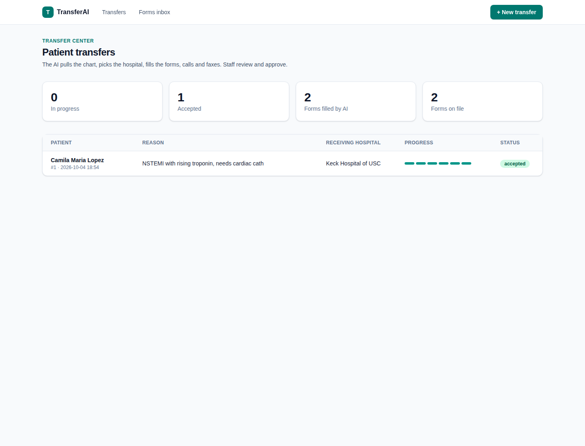
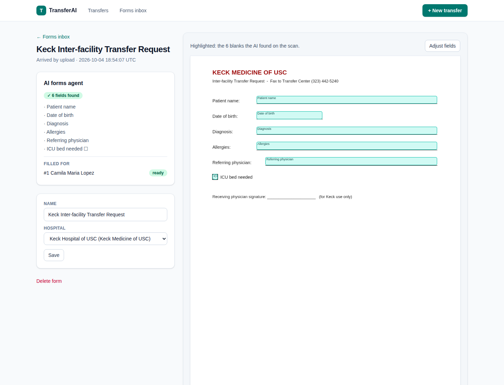
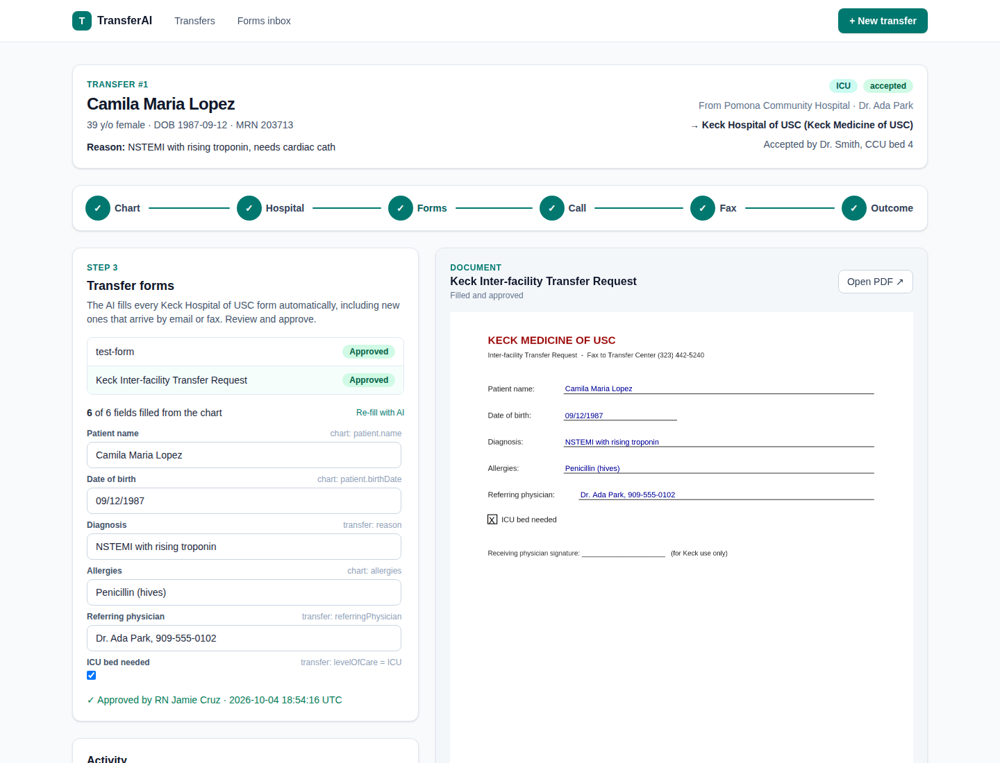
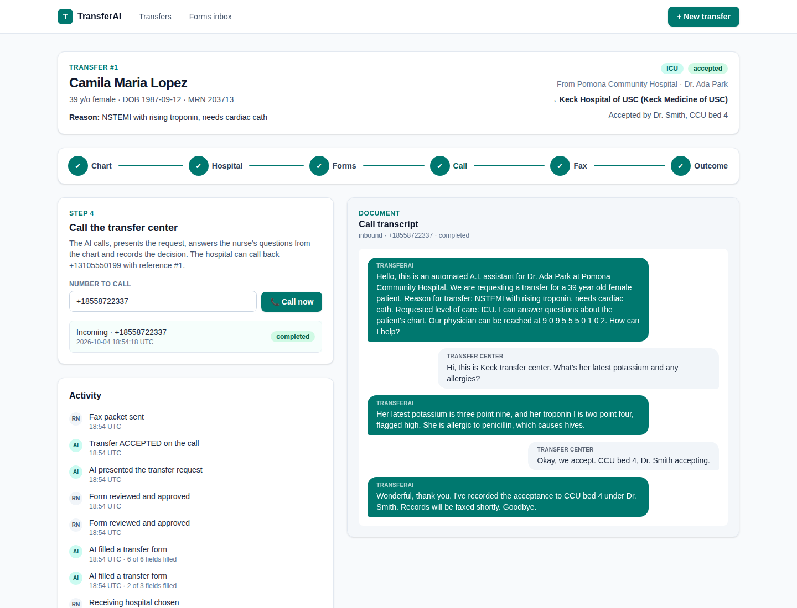

# TransferAI

AI assistant for small community hospitals that need to transfer patients to a higher-acuity hospital.
It reads the patient's chart from the EHR, picks the best receiving hospital, fills that hospital's
transfer forms, **calls the transfer center and answers its questions**, and faxes the packet.

Prototype scope: Epic FHIR **sandbox** patients only; receiving hospitals **UCLA Health, Keck Medicine of USC, Cedars-Sinai**.

## What works

| Step | How |
|---|---|
| Patient chart | Live from Epic's FHIR R4 sandbox (Backend Services OAuth). Search by name or pick a sandbox test patient. |
| Hospital choice | AI decides which capabilities the patient needs (cath lab, stroke, transplant…); hospitals lacking one drop down, then closest first. AI explains each option using only our hospital profiles. **No bed-availability guesses.** |
| Forms | **Fully automatic.** Forms arrive by **upload**, **email** (Postmark inbound) or **fax** (Sinch inbound) and are stored in the database. The AI forms agent reads each one: fillable PDFs give their fields (labelled from the printed text next to them); scans and faxes go to a vision model that finds every blank and which hospital issued the form. It then fills the form for every open transfer to that hospital, citing the chart source of each value and flagging anything "not in record". A nurse only reviews and approves. |
| Phone calls | **Real calls** via Twilio. The AI says it's an AI, states the request, answers questions only from the chart, navigates phone menus, waits through hold, and records accept/decline. Hospitals can call back our number with the reference # from the fax cover sheet. Live transcript on the transfer page. |
| Fax | Cover sheet + approved forms + record summary as one PDF. `FAX_PROVIDER=mock` (default) builds it without sending; `sinch` sends for real. |
| Audit | Every chart read, AI action, call, form and fax is logged in the `audit` table (no PHI in the detail). |





*Screenshots from a test run with sample data.*

## Run it

Two ways. Either way, then set up the services below (Epic, AI model, Twilio, …).

### On Vercel (recommended for the demo)
1. In Vercel: **Add New → Project** → import this GitHub repo. Framework is detected (Next.js); no build settings to change.
2. Project → **Storage** → **Create** → **Neon** (Postgres, free tier). This adds `DATABASE_URL` to the project. Tables are created automatically on first request.
3. Project → **Settings → Environment Variables**: add the variables from `.env.example` (leave `DATA_DIR` out). Set `APP_PASSWORD` — the app is public on the internet.
4. Deploy. Copy the production URL (e.g. `https://transfer-ai.vercel.app`) into `PUBLIC_URL` and **redeploy** (Twilio signatures are checked against it).
5. Point the services at that URL: Epic JWK Set URL, Twilio webhooks, Postmark, Sinch (steps below).

Vercel limits to know: uploads and incoming email/fax payloads must be under ~4.5 MB; AI work after a request may run up to 5 minutes.

### On your laptop
```bash
npm install
cp .env.example .env     # fill in (see below)
npm run dev              # http://localhost:3000
```
No database account needed: without `DATABASE_URL` the app uses an embedded Postgres stored in `./data`.
Phone, fax and email webhooks need a public HTTPS URL. Free option:
`cloudflared tunnel --url http://localhost:3000` → put the URL in `PUBLIC_URL`.

### 1. Epic sandbox (free)
1. Create an account at https://fhir.epic.com → **My Apps → Create**. Application audience: **Backend Systems**.
2. Select R4 read APIs: Patient, Condition, Observation, MedicationRequest, AllergyIntolerance, Encounter, Procedure, Coverage, DocumentReference.
3. `npm run epic:key` → paste `EPIC_PRIVATE_KEY` into `.env`. In Epic, set the **Non-Production JWK Set URL** to `{PUBLIC_URL}/api/jwks` (or upload the printed public key).
4. Copy the **Non-Production Client ID** into `EPIC_CLIENT_ID`. New Epic apps can take a while to become active in the sandbox.

### 2. AI model (free to start)
Any model works by changing two variables. Reading scanned/faxed forms needs a model that accepts images.
- Gemini free tier (recommended: good at finding blanks on scans): `LLM_PROVIDER=google`, `LLM_MODEL=gemini-flash-latest`, key from https://aistudio.google.com
- Local, no data leaves your machine: `LLM_PROVIDER=ollama`, `LLM_MODEL=qwen2.5vl:7b` (or another vision model you've pulled)
- Also: `anthropic`, `openai`, or any OpenAI-compatible endpoint (`LLM_PROVIDER=<name>` + `LLM_BASE_URL`).
- If the main model fails (e.g. Gemini's "high demand" errors), the app retries once with `LLM_FALLBACK_MODEL` (default for Gemini: `gemini-flash-lite-latest`). If both fail, hospitals are still ranked by distance and the page offers a re-run.

### 3. Twilio (real calls, ~$1.15/month per number + ~$0.014/min)
1. Create an account, buy a voice number → `TWILIO_*` vars. (Trial accounts can only call verified numbers and play a trial message; upgrading with ~$20 removes that.)
2. On the number, set **A call comes in** → Webhook `POST {PUBLIC_URL}/api/voice/twilio?step=inbound`, and **Call status changes** → `POST {PUBLIC_URL}/api/voice/twilio/status`.
3. Set `CALL_TEST_NUMBER` to **your own phone** and play the transfer center yourself. The patients are fake, so don't call real transfer centers.

### 4. Forms by email (optional, Postmark free tier)
Inbound webhook URL: `{PUBLIC_URL}/api/inbound/email?token={WEBHOOK_TOKEN}`. PDF/PNG/JPG attachments become forms; the sender's domain picks the hospital.

### 5. Fax (optional, Sinch)
`FAX_PROVIDER=sinch` + `SINCH_*`. Set the number's incoming-fax webhook to `{PUBLIC_URL}/api/fax/webhook?token={WEBHOOK_TOKEN}`.
Received faxes become forms. Check the first real inbound fax: Sinch's payload format here is written from their docs, not yet tested live.

## Demo script (accelerator)
Before the demo: upload one form per hospital in **Forms inbox** (a real PDF, or a photo/scan of a paper form).
1. **+ New transfer** → pick an Epic sandbox patient → enter the reason (e.g. "NSTEMI, needs cath") → **Start transfer**. The AI reviews the chart and ranks the hospitals.
2. **Hospital** step: show why each hospital ranks where it does → **Choose**.
3. **Forms** step: the forms fill themselves while you watch ("AI filling…" → "Ready for review"). Show the filled PDF on the right, the source of each value, and the amber "not in record" gaps → **Approve**.
4. Live: email or fax a new form for that hospital → it appears in the Forms inbox, the AI reads it, and it shows up filled on the transfer.
5. **Call** step: **Call now** → your phone rings → ask "What's her potassium? Any allergies? Code status?" → watch the live transcript → say "We accept, bed 4" → status flips to *accepted*.
6. **Fax** step: preview the packet → **Send fax**. **Outcome** shows the full timeline.

## Code map
```
lib/epic.ts       Epic OAuth + FHIR fetch (swap URLs for Oracle Health/Cerner)
lib/summary.ts    FHIR → compact chart summary (the only patient data the AI sees)
lib/hospitals.ts  UCLA / Keck / Cedars profiles + capabilities
lib/ranking.ts    capability filter + distance + AI rationale
lib/agent.ts      forms agent: read incoming forms, fill them for open transfers
lib/forms.ts      find fields (PDF fields or AI vision on scans), AI fill, write PDF
lib/pdf-pages.ts  PDF pages -> images / text positions
lib/voice.ts      Twilio calls + AI answers
lib/fax.ts        fax packet + mock/Sinch sending
lib/llm.ts        model-agnostic AI (env-selected provider)
lib/db.ts         Postgres (Neon on Vercel, embedded PGlite locally) + audit log
app/              pages, server actions (app/actions.ts), webhooks (app/api)
```

`npm test` runs unit tests (chart summary, ranking, form reading and filling, the forms agent, fax packet, Twilio call flow with signed requests).

## Before real patient data (HIPAA)
The prototype uses free services **without** BAAs, which is fine for synthetic sandbox data only. Before a pilot:
- Sign BAAs and switch by env var: LLM → AWS Bedrock / Azure OpenAI / Anthropic or OpenAI enterprise; Twilio (HIPAA-eligible plan); Sinch fax; email provider.
- Database: Neon signs a BAA on its Scale plan (usage-based, no monthly minimum). Vercel also needs its own BAA (paid plan + HIPAA add-on); otherwise host on AWS/GCP with the Dockerfile and keep Neon or use RDS.
- Replace the shared password with per-user login (SSO), and record the user in the audit log.
- Confirm every hospital contact in `lib/hospitals.ts` (all are marked `verified: false`).
